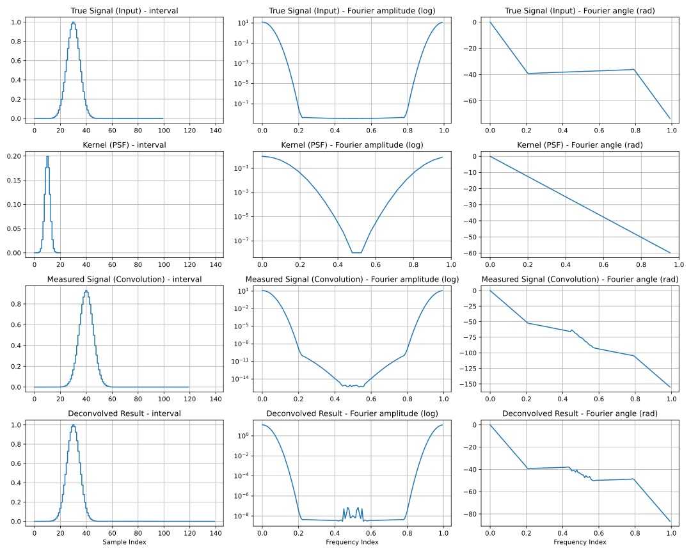
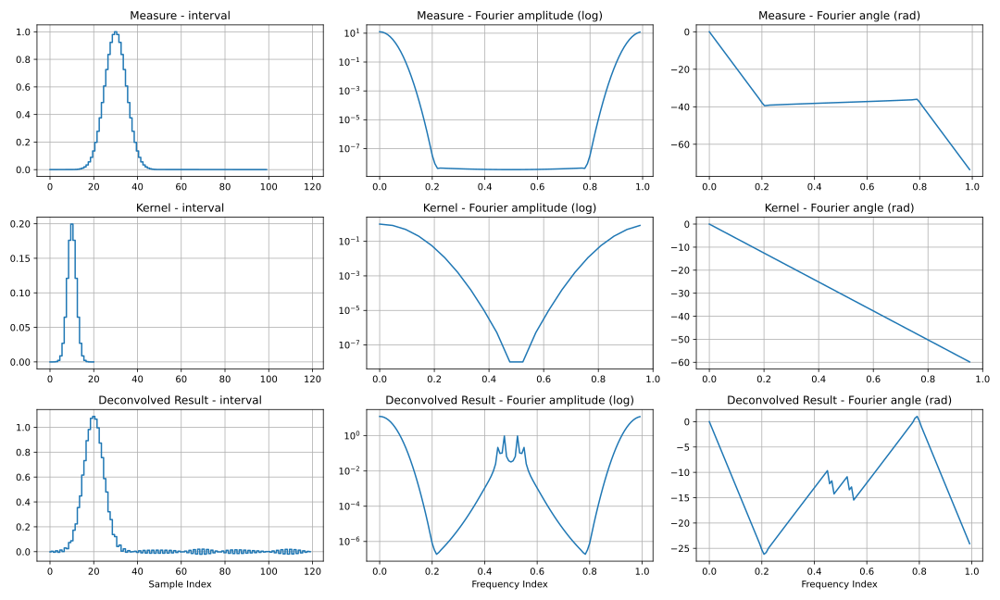
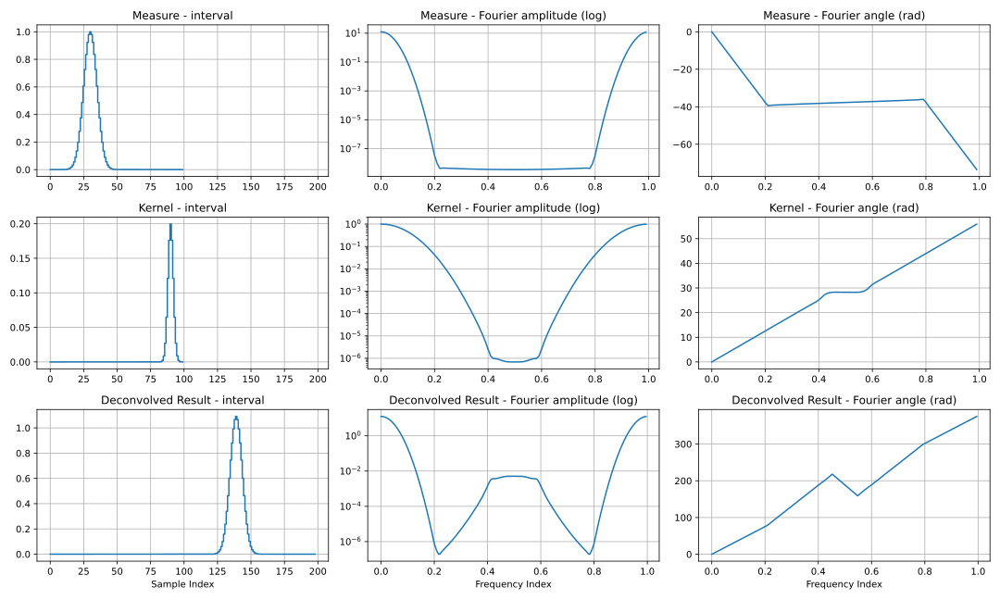
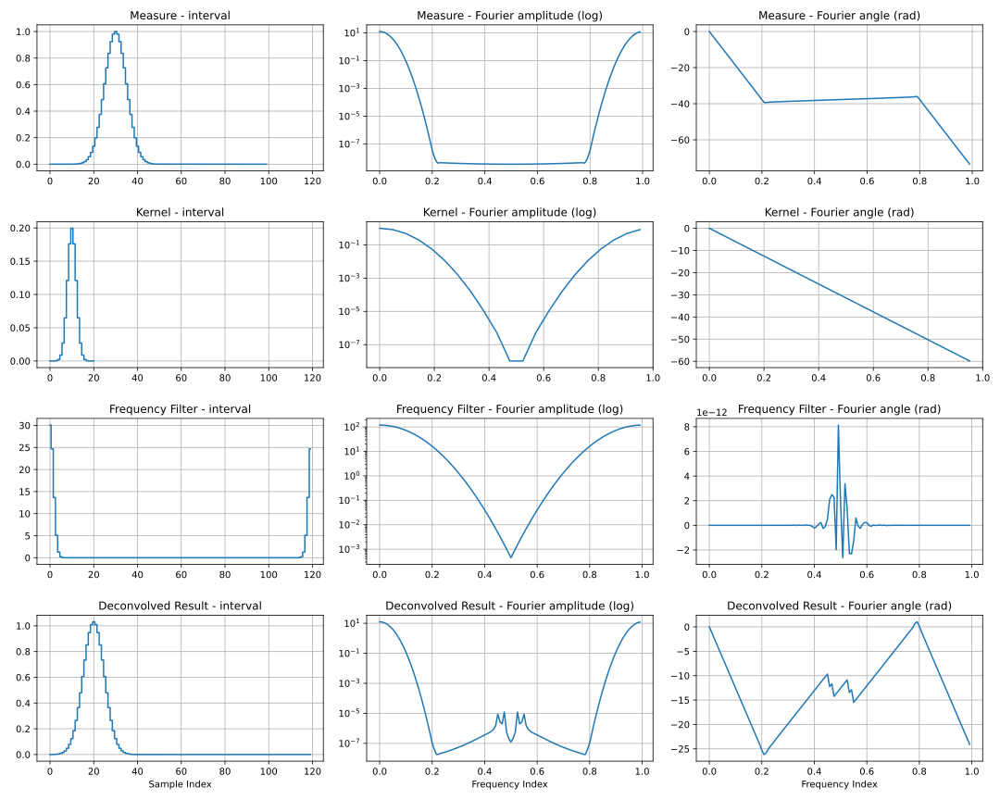
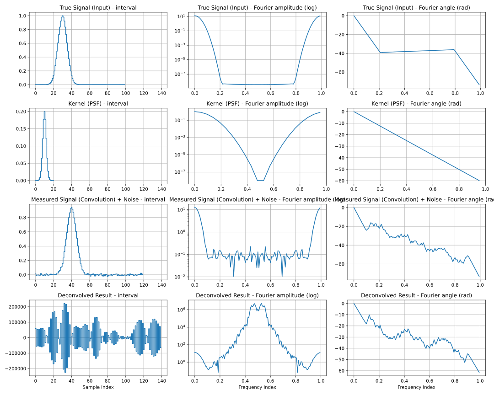
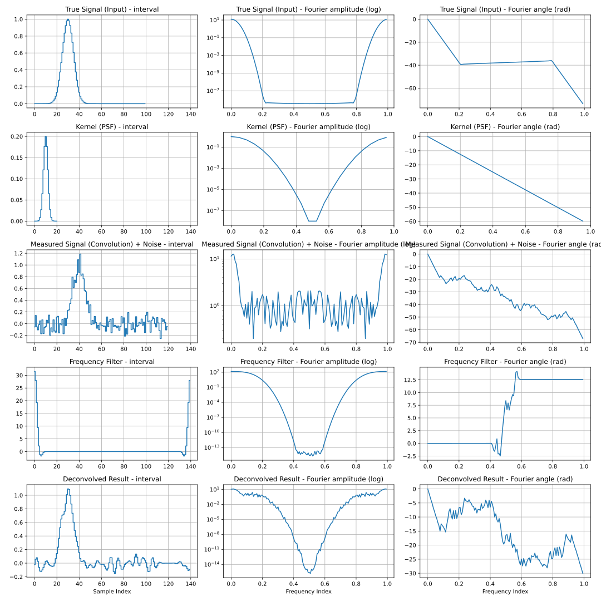

- [Goals and getting started](#orgf55e1b8)
- [Matched convolution and deconvolution](#org25ff3e5)
- [Unmatched convolution and deconvolution](#orgcae4241)
- [Shifts and cycles](#org3330711)
- [Filtered case](#orge104a81)
- [Adding noise](#org76d815b)
- [Noise filters](#orgdd36de9)


<a id="orgf55e1b8"></a>

# Goals and getting started

Goals are to illustrate:

-   [X] basic convolution and deconvolution
-   [X] deconvolution shifts
-   [X] floating point errors
-   [X] filters for FP errors
-   [X] effects of noise
-   [X] filters for noise
-   [ ] spectral leakage
-   [ ] mitigation with window / tapering functions
-   [ ] mitigation with extrapolation

```
$ uv tool install git+https://github.com/brettviren/decondemo
$ decondemo --help
```


<a id="org25ff3e5"></a>

# Matched convolution and deconvolution

```sh
uv run decondemo plot --output basic-convo-decon.svg
```

<div class="html" id="orgfe34435">

<div id="org9124344" class="figure">
<p>
</p>
</div>

</div>

The columns:

1.  A signal as a waveform in interval space (eg "time domain").
2.  The absolute value (amplitude) of the signal in Fourier space (eg "frequency domain").
3.  The unwrapped angle (phase) of the signal in Fourier space.

The interval representation is exactly identical to the combination of the Fourier representations via the DFT. The sample period is a unitless 1.0 as is the sample frequency. The Nyquist frequency is 0.5. The number of samples in interval and Fourier space are the same. As the interval representation is real, the Fourier representation has Hermitian symmetry.

The rows may include:

-   **S:** A "true signal" as a (truncated) Gaussian shape with some offset from zero.
-   **K:** A "kernel" also as a truncated Gaussian shape.
-   **M:** A "measure" which is the convolution M=S\*K.
-   **D:** A "deconvolved signal" from D = M/K = (S\*K)/K = S.
-   **F:** A "filter" (not shown here, see below).

When variables are given in capital letters, they refer to a complex-valued **spectrum** that is the Fourier representations of the interval-space **waveform**.

In this very basic example, the convolution to form measure M is essentially what the WCT simulation does though WCT uses a 2D kernel that is rather more varied than a simple Gaussian. The deconvolution to recover D as an estimate of S is half of what WCT signal-processing does, again with a more rich 2D kernel that is derived from the simulation 2D kernel. In this simple 1D case, the exact same kernel K is used in the convolution to form M and the deconvolution to achive D. To within floating point errors, D is exactly S.

Some things to note about these plots

-   The size of the measure M is larger than the size of both the signal S and the kernel K from which M is formed by convolution. This is because both S and K were **padded** to be a size that is the sum of their original sizes minus 1 prior to the convolution. This is required in order that the convolution suffers no **cyclic artifacts** though it is still subject to cyclic convolution.

-   The recovered signal D is **shifted** "backwards in time" relative to the measure and its peak is in the same location as the original signal S. This is due to the kernel K being peaked away from the zero sample.

-   We see in the spectrum of D some high-frequency energy. This arises from a combination of floating point errors and dividing by small values of K in the deconvolution. Later, we will address this with a **filter** below.


<a id="orgcae4241"></a>

# Unmatched convolution and deconvolution

Now consider a measure M that is not produced by a convolution of signal S with kernel K and deconvolved with matched kernel K. The demo simulates this simply by generating the measure directly as a Gaussian waveform.

```sh
uv run decondemo plot --signal-is-measure --output basic-decon.svg
```

<div class="html" id="org963e57a">

<div id="org719282c" class="figure">
<p>
</p>
</div>

</div>

Like in the matched kernel case, the recovered signal D = M/K is shifted back in tme relative to the measure M due to the kernel K being offset from zero. The main difference we see is D gains high-frequency wiggles. This is due to the kernel K not matching what (unknown) kernel was used to produce the measure M. Specifically, since M is a simple Gaussian it has a single Gaussian spectrum unlike the matched case where we see M has two Gaussians in the spectrum and the K part is thus almost perfectly divided out.

This unmatched case is analogous to the full WCT deconvolution where the deconvolution kernel does not match the convolution kernel, be that applied in simulation or in nature.


<a id="org3330711"></a>

# Shifts and cycles

A convolution, in a sense, smears out a signal S by the kernel K. Both arrays must be "padded" to a size that is the sum of each minus one. The "smearing" past the end of S is then placed in the padded region. If the convolution is performed in the original array size, say that of S, this "smearing" will wrap around the end of the array and add onto the beginning of the array causing **cyclic artifacts**. The padding avoid these but the result is subject to the fact that the (padded) convolution is still cyclic.

When the kernel as a peak that is away from the first sample, the "smearing" effectively has a "shift" as well. When that kernel is convolutional, the shift is in the positive direction (larger sample number). When deconvolutional, the shift is in the opposite direction toward smaller sample number.

Padding is generally applied to the end of arrays. Convolution with a kernel that has a peak away from zero will then move signal features toward the end of the padded result. This looks natural. However, in a deconvolution, a kernel peak may be displaced further away from zero than any input measure peak. This will result in the peak in D to be shifted so far to lower samples that it wraps around and shows up at the "end" of the array.

The demo can show this by adjusting the location of the kernel:

```sh
uv run decondemo plot --kernel-size=100 --kernel-mean=90 --signal-is-measure --output basic-decon-shift.svg
```

<div class="html" id="org0d15f5e">

<div id="org0e1fdb7" class="figure">
<p>
</p>
</div>

</div>

As we showed above, deconvolution with kernel K should shift the recovered signal D "backwards in time". However, here, it appears to have shifted "forward in time". In fact, the shift is so far backwards that the peak cycles around from the front to the back of the D array. The amount of the apparent shift depends on the content of the kernel, ie where it is peaked. However, one can think of deconvolving measure M with kernel K of size Nk as producing recovered signal D where the last Nk samples correspond to "negative time" before the time of the first sample of M. One can **roll** the result D so that these "negative time" samples precede the start time of M.


<a id="orge104a81"></a>

# Filtered case

In order to combat deconvolution artifacts (and later noise) we may apply an arbitrary filter as part of the deconvolution to form D = M\*F/K.

The filter will distort the recovered signal D. We attempt to craft the filter to provide desirable distortion while minimizing unwanted distortion. In practice this needs a careful optimization. Here is one example.

```sh
uv run decondemo plot --signal-is-measure --filter-name=lowpass --filter-scale=0.1  --output basic-filtered-decon.svg
```

<div class="html" id="org42b2f26">

<div id="orgcab34e2" class="figure">
<p>
</p>
</div>

</div>

This inserts the filter F waveform and spectrum. The chosen filter is a "low-pass filter" (aka a "high frequency filter") in that it "passes" low frequency energy and attenuates (filters) the rest. In this example, the attenuation reduces the effect of dividing by small values of K and removes the high-frequency wiggles.

Note the filter waveform is cyclically symmetric about the zero interval sample. This is a result of the filter being symmetrically defined in Fourier space as a real valued sampling. This is good for as because it is effectively convolved with the measure M and we do not want it to introduce any artificial shifts.


<a id="org76d815b"></a>

# Adding noise

Real signals always come with noise. The demo has a simple white noise model. We go back to the ideal matched case and add the smallest of noise and that it utterly destroys the ability to recover the signal.

```sh
uv run decondemo plot --noise-rms=0.01 --output basic-convo-decon-noisyq.svg
```

<div class="html" id="orgab2cd8c">

<div id="org1b968c5" class="figure">
<p>
</p>
</div>

</div>

In fact, one may rerun the demo with noise that is too small to be visible in the measured waveform M and the D waveform is still unrecognizable as signal. Matters become even more hopeless when the convolution and deconvolution kernels are not matched.


<a id="orgdd36de9"></a>

# Noise filters

The origin of the noise problem is similar to that of floating point errors but much larger. The high frequency power from the noise is amplified by the division of small values of K. As with FP errors, we may apply a low-pass filter to combat the amplified HF noise. However, the filter must be more aggressive.

```sh
uv run decondemo plot --noise-rms 0.1 --filter-name=lowpass --filter-scale=0.1 --filter-power=3.0 --output basic-convo-decon-noise-filter.svg
```

<div class="html" id="org623302e">

<div id="orgad5013c" class="figure">
<p>
</p>
</div>

</div>

Note, the noise has been increased by an order of magnitude to give the filter a greater challenge and we also use matched convolution and deconvolution kernels to focus on noise and filtering. The signal is recovered reasonably well though clearly the effect of noise can be seen.
